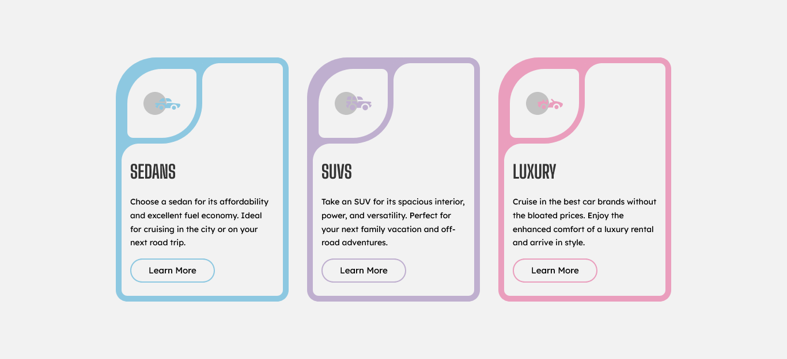

# Frontend Mentor - 3-column preview card component (Custom Version)

This is a custom version solution to the [3-column preview card component challenge on Frontend Mentor](https://www.frontendmentor.io/challenges/3column-preview-card-component-pH92eAR2-). Frontend Mentor challenges help you improve your coding skills by building realistic projects.

## Table of contents

- [Overview](#overview)
  - [The challenge](#the-challenge)
  - [Screenshots](#screenshot)
  - [Links](#links)
- [My process](#my-process)
  - [Built with](#built-with)
- [Author](#author)
- [Acknowledgments](#acknowledgments)

## Overview

### The challenge

Users should be able to:

- View the optimal layout depending on their device's screen size
- See hover states for interactive elements

### Screenshots

## Original

## Custom

### Links

- Original URL: [Github Pages](https://bccpadge.github.io/3-column-preview-card-component/)
- Custom version URL: [Github Pages](https://bccpadge.github.io/3-column-preview-card-component-custom-version/)

## My process

### Built with

   
   

## Author

## Acknowledgments

[CSS inverted border-radius cards](https://www.youtube.com/watch?v=tuKeRe9X0zI)
